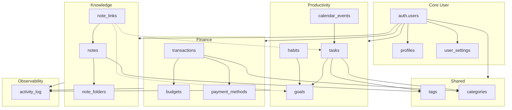
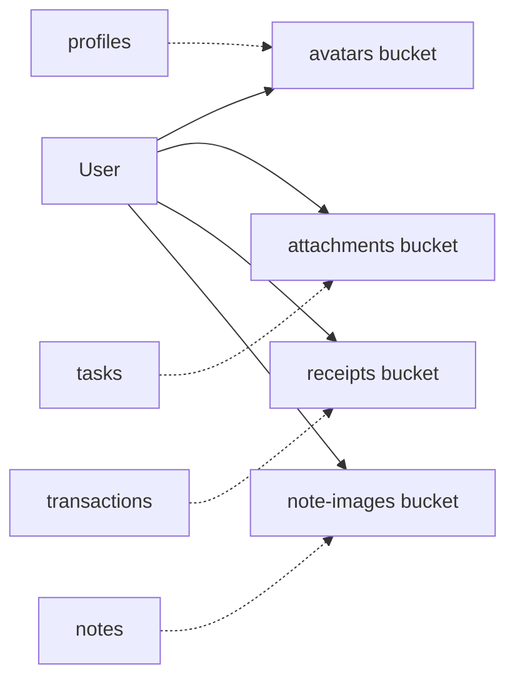

# 05 — Entity-Relationship Diagram

## Full ER diagram (Mermaid)

```mermaid
erDiagram
    AUTH_USERS ||--|| PROFILES : "1:1"
    AUTH_USERS ||--|| USER_SETTINGS : "1:1"
    AUTH_USERS ||--o{ TAGS : "owns"
    AUTH_USERS ||--o{ CATEGORIES : "owns"

  AUTH_USERS ||--o{ TASKS : "owns"
    TASKS ||--o{ TASKS : "parent/subtask"
    TASKS }o--o| GOALS : "linked"
    TASKS }o--o| CATEGORIES : "categorized"
    TASKS ||--o{ TASK_CHECKLIST_ITEMS : "has"
    TASKS ||--o{ TASK_DEPENDENCIES : "depends"
    TASKS ||--o{ TASK_ATTACHMENTS : "has"
    TASKS }o--o{ TAGS : "task_tags"

    AUTH_USERS ||--o{ CALENDAR_EVENTS : "owns"
    CALENDAR_EVENTS }o--o| TASKS : "optional link"

    AUTH_USERS ||--o{ HABITS : "owns"
    HABITS }o--o| GOALS : "linked"
    HABITS ||--o{ HABIT_COMPLETIONS : "logged"

    AUTH_USERS ||--o{ GOALS : "owns"
    GOALS ||--o{ MILESTONES : "has"
    GOALS ||--o{ TASKS : "tracks"

    AUTH_USERS ||--o{ PAYMENT_METHODS : "owns"
    AUTH_USERS ||--o{ BUDGETS : "owns"
    BUDGETS }o--|| CATEGORIES : "for category"
    AUTH_USERS ||--o{ TRANSACTIONS : "owns"
    TRANSACTIONS }o--o| CATEGORIES : "categorized"
    TRANSACTIONS }o--o| PAYMENT_METHODS : "paid via"
    TRANSACTIONS }o--o{ TAGS : "transaction_tags"

    AUTH_USERS ||--o{ NOTE_FOLDERS : "owns"
    NOTE_FOLDERS ||--o{ NOTE_FOLDERS : "nested"
    AUTH_USERS ||--o{ NOTES : "owns"
    NOTES }o--o| NOTE_FOLDERS : "in folder"
    NOTES }o--o{ TAGS : "note_tags"
    NOTES ||--o{ NOTE_LINKS : "links to"

    AUTH_USERS ||--o{ ACTIVITY_LOG : "generates"

    AUTH_USERS {
        uuid id PK
        string email
    }

    PROFILES {
        uuid id PK_FK
        string full_name
        string avatar_url
        string timezone
        string currency
        string theme
    }

    USER_SETTINGS {
        uuid id PK
        uuid user_id FK
        boolean email_notifications
        jsonb settings_json
    }

    TAGS {
        uuid id PK
        uuid user_id FK
        string name
        string color
    }

    CATEGORIES {
        uuid id PK
        uuid user_id FK
        string name
        string type
    }

    TASKS {
        uuid id PK
        uuid user_id FK
        uuid parent_id FK
        uuid goal_id FK
        string title
        enum status
        enum priority
        timestamptz deadline
        jsonb repeat_rule
        timestamptz deleted_at
    }

    TASK_CHECKLIST_ITEMS {
        uuid id PK
        uuid task_id FK
        string title
        boolean is_completed
    }

    TASK_DEPENDENCIES {
        uuid id PK
        uuid task_id FK
        uuid depends_on_task_id FK
    }

    TASK_ATTACHMENTS {
        uuid id PK
        uuid task_id FK
        string file_path
    }

    CALENDAR_EVENTS {
        uuid id PK
        uuid user_id FK
        uuid task_id FK
        string title
        timestamptz start_at
        timestamptz end_at
        enum recurrence
    }

    HABITS {
        uuid id PK
        uuid user_id FK
        uuid goal_id FK
        string name
        enum frequency
        int target_count
    }

    HABIT_COMPLETIONS {
        uuid id PK
        uuid habit_id FK
        timestamptz completed_at
    }

    GOALS {
        uuid id PK
        uuid user_id FK
        string title
        enum type
        enum status
        int progress
        date target_date
    }

    MILESTONES {
        uuid id PK
        uuid goal_id FK
        string title
        boolean is_completed
    }

    PAYMENT_METHODS {
        uuid id PK
        uuid user_id FK
        string name
    }

    BUDGETS {
        uuid id PK
        uuid user_id FK
        uuid category_id FK
        decimal amount
        enum period
    }

    TRANSACTIONS {
        uuid id PK
        uuid user_id FK
        uuid category_id FK
        enum type
        decimal amount
        date transaction_date
    }

    NOTE_FOLDERS {
        uuid id PK
        uuid user_id FK
        uuid parent_id FK
        string name
    }

    NOTES {
        uuid id PK
        uuid user_id FK
        uuid folder_id FK
        string title
        jsonb content
        string content_text
    }

    NOTE_LINKS {
        uuid id PK
        uuid note_id FK
        string entity_type
        uuid entity_id
    }

    ACTIVITY_LOG {
        uuid id PK
        uuid user_id FK
        enum entity_type
        uuid entity_id
        enum action
        jsonb metadata
    }
```

---

## Domain relationship map (simplified)



---

## Cardinality reference

| Relationship | Cardinality | Notes |
|--------------|-------------|-------|
| User → Profile | 1:1 | Created on signup |
| User → Tasks | 1:N | |
| Task → Subtasks | 1:N | Self-referential `parent_id` |
| Task → Goal | N:1 | Optional |
| Task ↔ Tag | N:M | `task_tags` |
| Task → Dependencies | N:M | `task_dependencies` |
| Habit → Completions | 1:N | One per day max |
| Goal → Milestones | 1:N | Ordered |
| Goal → Tasks | 1:N | Progress auto-calculated |
| Transaction ↔ Tag | N:M | `transaction_tags` |
| Note → Folder | N:1 | Nullable (inbox) |
| Note → Entity | N:M | Polymorphic `note_links` |
| Category → Budget | 1:N | One budget per category per period |

---

## Storage relationships (non-relational)



Storage paths reference `file_path` columns; no FK to Storage API (by design).
