# 06 — User Flows

Key journeys mapped as flow diagrams. Each flow assumes an authenticated user unless noted.

---

## 1. Onboarding & Authentication

### 1.1 New user registration (email)

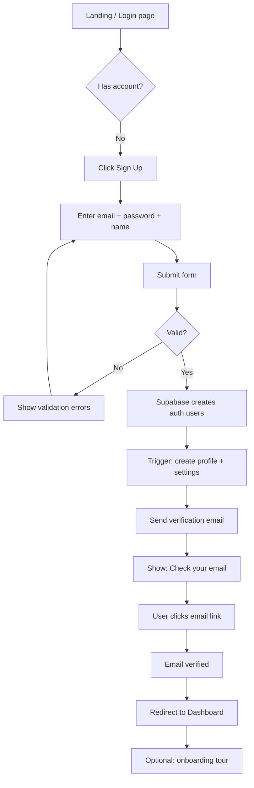

### 1.2 OAuth sign-in (Google / GitHub)

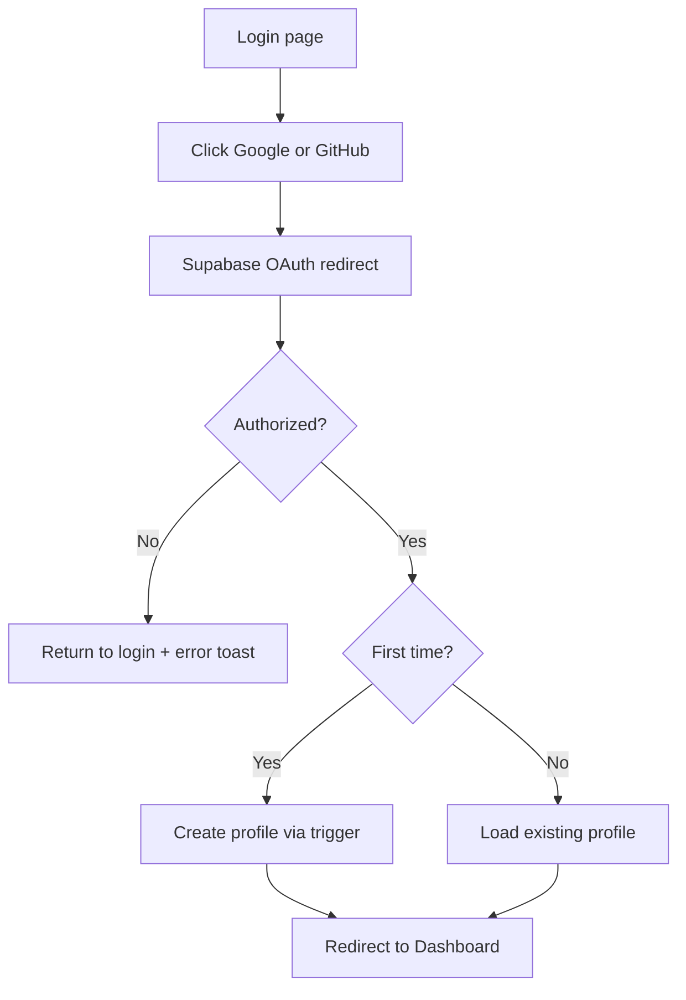

### 1.3 Forgot password

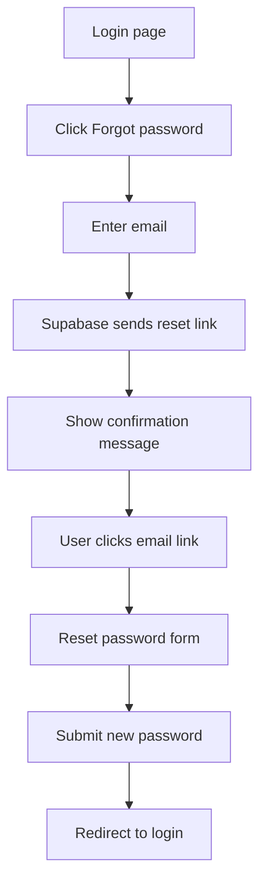

---

## 2. Daily use — Morning check-in

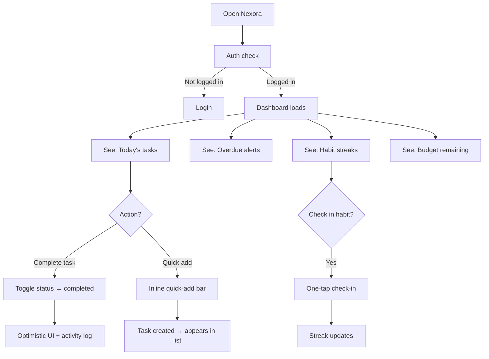

---

## 3. Task management

### 3.1 Create task (full form)

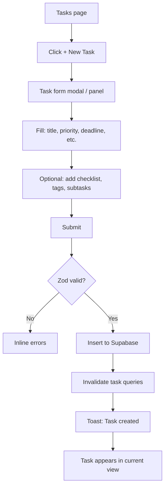

### 3.2 Kanban workflow

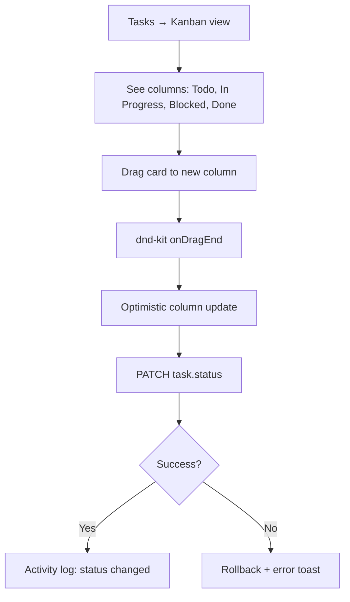

### 3.3 Recurring task

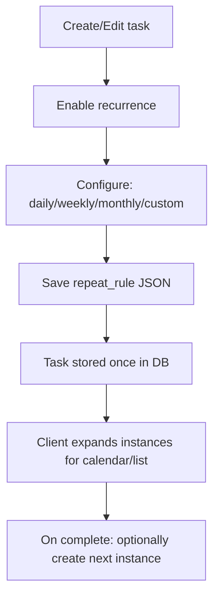

---

## 4. Calendar

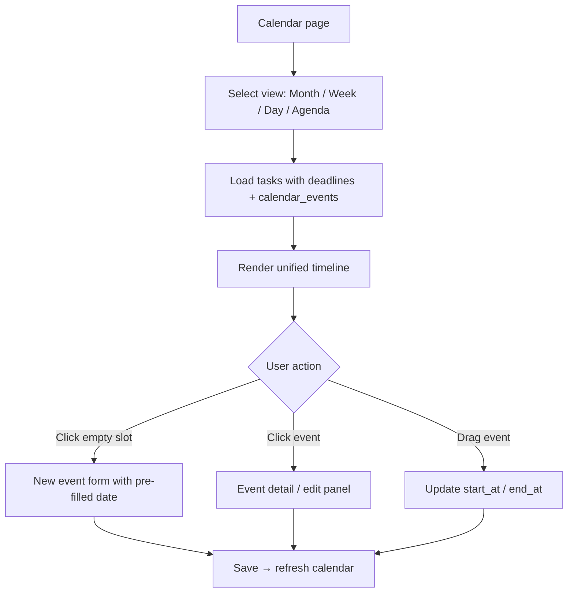

---

## 5. Habit tracking

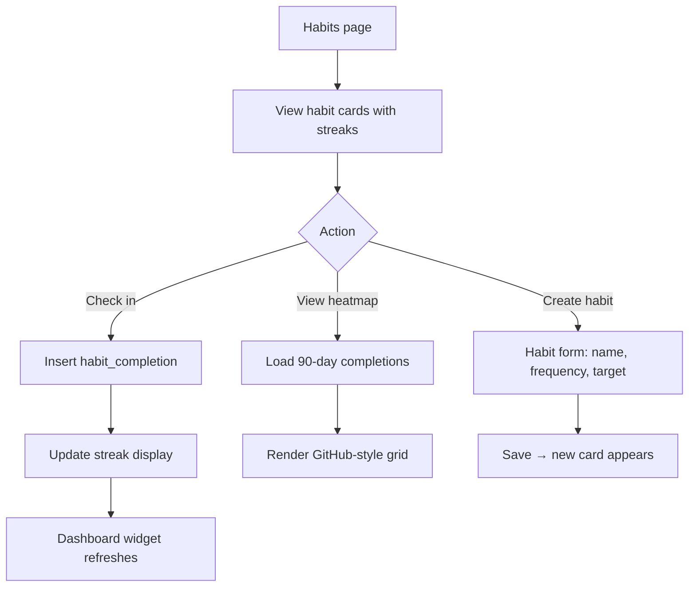

---

## 6. Expense tracking

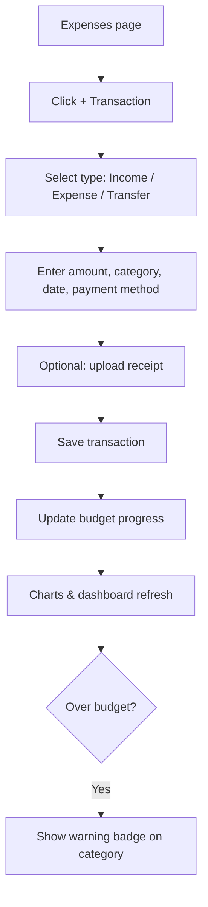

---

## 7. Goals & milestones

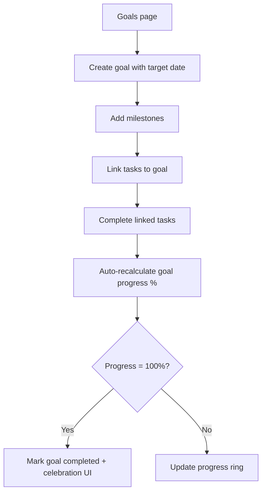

---

## 8. Notes

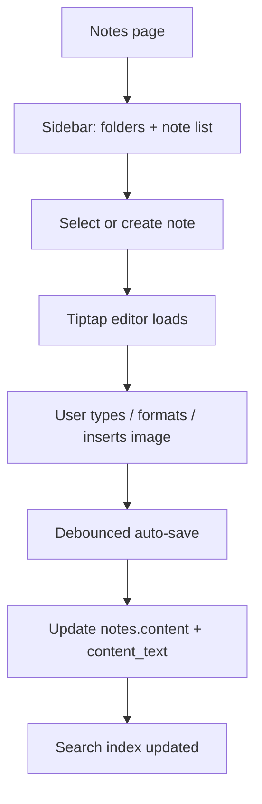

---

## 9. Analytics & Reports

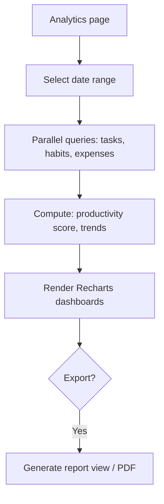

---

## 10. Settings & data management

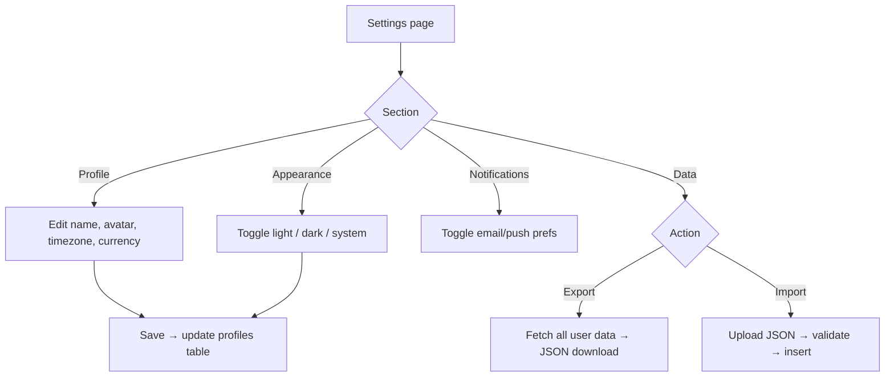

---

## 11. Error & edge case flows

### Session expired
```
API 401 → Clear session → Redirect to /login → Toast "Session expired"
```

### Network offline
```
Mutation fails → Toast "Offline" → Keep optimistic state → Retry on reconnect
```

### RLS violation
```
Supabase error → Toast "Permission denied" → Log to console (dev)
```

### Soft-deleted item
```
Trash view → Restore (clear deleted_at) OR Permanent delete
Archive view → Unarchive (clear is_archived)
```

---

## 12. Navigation flow (authenticated app)

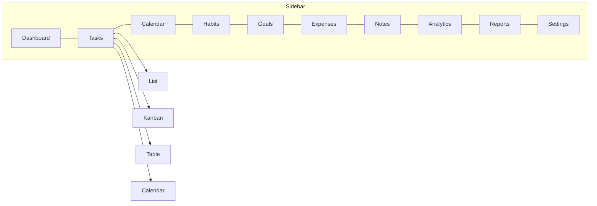

Mobile: Sidebar collapses to bottom tab bar (Dashboard, Tasks, Calendar, More).
